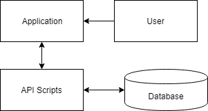
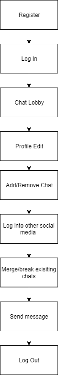
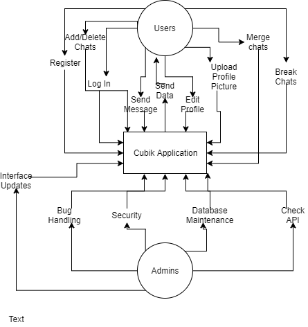
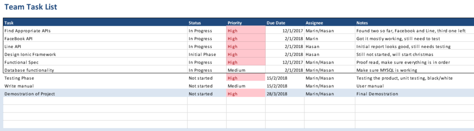
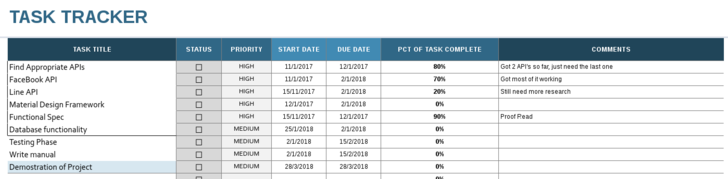

Table of Contents

===
&nbsp;
## [1.Introduction](#1-introduction)
### [1.1 Purpose](#11-purpose1)
### [1.2 Business Context](#12-business-context1)	
### [1.3 Intended Audience and Reading Suggestions](#1.3)
### [&nbsp;&nbsp;&nbsp;&nbsp;&nbsp; 1.3.1 Glossary](#1.3.1)
&nbsp;
## [2.General Description](#2)
### [2.1 System Functions](#2.1)	
### [2.2 User characteristics and Objectives](#2.2)						
### [2.3 Operational Scenarios](#2.3)
### [2.4 Design and Implementation Constraints](#2.4)						
### [2.5 Operating Environment](#2.5)
### [2.6 User Documentation](#2.6)
### [2.7 Assumptions and Dependencies](#2.7)
&nbsp;
## [3. Functional Requirement](#3)
### [3.1 Sign Up/Register](#3.1)
### [3.2 Sign In](#3.2)
### [3.3 Chat Lobby](#3.3)
### [3.4 Profile](#3.4)
### [3.5 Upload Image](#3.5)
### [3.6 Add/Remove Chats](#3.6)
### [3.7 Log into different social media.s](#3.7)
### [3.8  Merge/Break Chats](#3.8)
### [3.9 Messaging](#3.9)
### [3.10 Log Out](#3.10)
&nbsp;
## [4. System Architecture](#4)
### [4.1 System Architecture Diagram](#4.1)
### [4.2 Website](#4.2)
### [4.3 PHP API](#4.3)
### [4.4 Database](#4.4)
## [5. High-Level Design](#5)
### [5.1 Design Overview](#5.1)
### [5.2 High Level Description](#5.2)
###	[&nbsp;&nbsp;&nbsp;&nbsp;&nbsp; 5.2.1 High Level Design 
Diagram](#5.2.1)
### [&nbsp;&nbsp;&nbsp;&nbsp;&nbsp; 5.2.2 High Level Design Diagram 
(From our Perspective)](#5.2.2)
### [5.3 Context Diagram](#5.3)	
&nbsp;
## [6. Schedule](#6)
### [6.1 Overview of Preliminary Schedule](#6.1)
### [6.2 Task List](6.2)
### [6.3 Task Tracker](6.3)
&nbsp;
## [7. Appendix](#7)
### [7.1 Appendix A: Resources](#7.1)
### [7.2 Appendix B: References](#7.1)
       										 
&nbsp;

1 Introduction

===

### 
1.1 Purpose

The product being developed is best described as an Messaging 
Application. It will allow people to link up their various social media 
chat feature into one application. Members will be able receive and send 
messages from various social medias in our application. They can then 
send one message, to another user that will send to all that users 
social media selected. The system was developed to serve the needs of 
people with limited time to check all their messaging social media.s, 
this application helps satisfy that need. Various other functions are 
available, and these will be listed and explained more in depth later. 
For now, we have decided to use three social medias as the foundation of 
this app, however that number might increase depending on the API.s that 
we find, please note that this is still in the early stage.

### 
1.2 Business Context

There are four possible business contexts in relation to this product. 
These contexts are:

* *Selling the Application: The product could be sold in the electronic 
stores with a one-off payment.*

* *Buying the Application: Larger companies get in touch to buy the 
software.*
 
* *Advertising: The application can have a system for advertisement to 
develop, this can be generalized or targeted at specific users of the 
application.  There is also the  possibility that bigger companies 
like facebook and instagram would want to collaborate with our 
application.*

* *Features: Application can have special features within, that can only 
be accessed through a subscription or a fee. *

### 
1.3 Intended Audience and Reading Suggestions

The Application is targeting anyone who has more than one social media 
platform that we have chosen, therefore the target audience is very 
broad. 
This document is targeted for computer science majors, developers, 
computer science lecturers or anyone that has an interest in application 
development. We suggest people read the document from the beginning to 
end, however the table of content is there for anyone who has an 
interest in certain sections of the document.
The document has several words that are related to the technological 
aspect of the application and therefore we will provide a glossary for 
keywords in this document. 

### 
1.3.1 Glossary

* **PHP**: Recursive acronym for PHP Hypertext Processor. An open 
source, server-side, HTML embedded scripting language used to create 
dynamic Web pages. 

* **API**: In computer programming, an application programming interface 
(API) is a set of subroutine definitions, protocols, and tools for 
building application software. In general terms, it is a set of clearly 
defined methods of communication between various software components.

* **Material Design Framework**: It is a complete open-source SDK. A 
modern responsive front-end framework based on Material Design  Concept 
designed by Google. 

* **Server**: Sharing data or resources among multiple clients, or 
performing computation for a client, also this will be our personal 
server.

* **HTML**: Acronym for: Hypertext Markup Language. This is the 
authoring language used to create documents on the World Wide Web.
 
* **SQL**:An example of Associative Memory in Databases and the 
implications in terms of programming languages is SQL. In SQL, data is 
stored as tuples (rows) in relations (tables).

* **MYSQL**:MySQL is an open-source relational database management 
system

* **Session**: The period of time a user interfaces with an application. 
The user session begins when the user accesses the application and ends 
when the user quits the application. This also refers to the amount of 
time a user uses a website for. The session starts once the user logs in 
and finishes when the user logs out.

2	GENERAL DESCRIPTION

===

### 
2.1 System Functions

Since our project is a messaging application, it will have several 
functions which will be briefly touched upon in this section. Starting 
up the application users will need to go through a process. We will 
outline the general process below:

* *Register* ~ New users are required to register to access the 
application.

* *Log In* ~ Users logging in with their username and password will be 
directed to their main        chat lobby.

* *Create Profile* ~ Upon registering, users will be able to make their 
profile.

* *Upload Image(s)* ~ Users will be assigned the default picture, 
however they are able to upload an image for their profile picture at 
any point in time.

* *Add/Remove Chats* ~ Selecting the add feature in the application, the 
users are given choices of social media to log into, where they are then 
told to highlight the user they wish to add to the application. An 
option to remove friends is also available if they choose to delete 
their chat.

* *Merge/break* ~ Clicking on the friends chat profile, users are given 
the choice to merge or break the chats that they have in their chat 
lobby.

### 
2.2 User Characteristics and Objectives

The application is cross-platform and therefore will be accessible to 
any user with access to the internet. Since the target audience is 
anyone with more than one social media, it will be too broad to specify 
a specific age group or gender.
As the application will be hosted cross-platform, the product is 
accessible to anybody access to the Internet. The target audience will 
be anyone with the social medias we choose to implement. The application 
interface will be able to accommodate users with little or no knowledge 
of computing,however a user guide/video will be provided for people who 
have difficulty with technology.

### 
2.3 Operational Scenarios

Due to the design of our application, there will be different scenarios 
under which the application will have to perform, below will be the 
different scenarios:

* Unregistered User: The unregistered user will have to register with 
our application to be able to enter the application, they will be able 
to register on their mobile devices or through the internet.

* Registered User (not logged in): The registered user, will also have 
to log in assuming that they logged out when they used the application 
last. 

* Registered User (logged in):In this scenario we are assuming the user 
has registered and logged in before, and has not logged out, this will 
direct the user directly to his chat lobby, using the application fully.

* Edit Profile- Allows a logged in/registered user to update their 
personal profile with a small bio and the ability to upload a picture.

* Upload Images- You can add an image to your profile.

* Add/Remove Chats- Each user will be able to add their chats they have 
had with friends from different social medias, they can easily remove 
their chats as well. 

* Log in different social medias: After activating the Add feature, 
users will be required to log into their perspective social medias, and 
select the chats that they wish to import to our application

* Merge/Break chats: This is one of the main features of the 
application, users can merge existing chats into one. They will also be 
able to reverse it with the break feature.

* Log Out- Users will also have the option to log out of their 
application, since its cross platform, having this feature ensure a 
secure closed session.

### 
2.4 Design and Implementation Constraints

Since this is a messaging application data input and output is 
essential, therefore using a database is crucial and with that memory 
becomes a problem. Since we are using MYSQL account, we have limited 
scalability with our project. For the early stages of the application 
development it will not be a problem however as we increase social 
medias and have more users, database management significance will 
increase.
Since this project has a time constraint, the application will implement 
three social medias for the users, as the project evolve more API.s are 
estimated to be added. However with our initial research, finding 
companies with good API.s that are not deprecated will be the major 
concern and therefore getting into contact with companies to have some 
sort of collaboration will be essential for the growth of the 
application.
 

### 
2.5 Operating Environment

Since the application is cross-platform, it can be accessed through any 
device with internet access. 

### 
2.6 User Documentation

We hope to provide the user with a guide on how the application works, 
either in the form of a video tutorial or a set of instructions within 
the application. 

### 
2.7 Assumption and Dependencies

The application depends on the API of the social medias we choose, 
therefore if the API is deprecated we would need to readjust the code, 
preventing it from crashing.  The application also requires users 
logging into their different social media to access their messaging 
application, therefore if the user forgets their password, it will limit 
their access in the application.

3	Functional Requirement

===
### 
 3.1 Sign Up/Register

**Description**
When using the application, there is button for the user to register, 
this is the first step new users need to make to become a member. Once 
the button is clicked users will be redirected to the registration part 
of the application where they will need to input some essential 
information, like their username and password. After completing this 
step users will be sent back to the main log in section of the 
application

**Criticality**
This is a critical step for new users to the application, without it 
users will not be able to proceed further into the application.

**Technical Issues**
The registration process will be handled by the ionic framework used for 
this project, also a database will be implemented to save certain pieces 
of information pertaining to the user. 

**Dependencies**
Users have to create strong credentials both for remembering and for 
protection.

### 
3.2 Sign In

**Description**
This is considered the second step of the process, users need to input 
their registered username and password to enter the main features of the 
application.

**Criticality**
The process is critical for people who are either first-timers when it 
comes to logging in or users who logged out when using the application 
before and would need to sign in again.

**Technical Issues**
Username and password is stored in our SQL database, technically making 
sure it's working properly would be the only technical issue. Users who 
forget their password have the option to get their password sent to them 
via email. 
Making the session cookie secure enough to let the user continue a 
session.

**Dependencies**
Users username and password.

### 
3.3 Chat Lobby

**Description**
The main part of the application, the chat lobby displays all the 
options the user has, including visually seeing the chats that already 
exist. User can navigate to any part of the application in this section. 

**Criticality**
Without this function, users won't be able to access any other part of 
the application.

**Technical Issues**
Since the application is cross platform, it means we have to make it 
consistent across all devices, so that the design is fluid and 
materialized while keeping the same functionality.

**Dependencies**
Software developers fixing bugs when they appear, because of the 
different devices with different resolutions constantly appearing on the 
market.

### 
 3.4 Profile 

**Description**
Users have the option to alter their profile, once clicked upon users 
can add a small bio and have the ability to upload an image as their 
profile picture. This part of the application isn.t mandatory, if users 
ignore this section they will have a default image as their profile 
picture and their bios will be empty.

**Criticality**
Not critical to the usage of the application.

**Technical Issues**
Styling it to user.s preference.

**Dependencies**
Users willingness to alter their profile.

### 
 3.5 Upload Image 

**Description**
This function allows the user to add an image to their profile. This 
will allow the user to browse folders on their device and upload the 
selected image. 

**Criticality**
This function is not essential, it is up to the user. However if they do 
want to upload a picture, we need their permission to access their 
library if they are using it on a mobile device. 

**Technical Issues**
 It is quite difficult to get cross platform image upload while keeping 
the fundamental design the same.

**Dependencies**
Users permission to access their devices library. 

### 
3.6 Add/Remove chat

**Description**
A function that allows users to import their social media.s chats to the 
application. There will also be an option to remove existing chats.

**Criticality**
This function is critical to the application, as this is the main 
feature and premise the application is built.

**Technical Issues**
The API.s of the social media the users selects haven't deprecated, 
allowing us access to their chats. Importing the data successfully.

**Dependencies**
Depends on the Social medias API.s.

### 
3.7 Log into different social media.s

**Description**
When using the add/remove friends feature of the application, users are 
required to log into that social media before selecting the chats they 
want to import to the application.

**Criticality**
We need this function to access their social medias. It can also be seen 
as needing the users permission to import their chats to the 
application.

**Technical Issues**
Users need to be able to log into their social medias, handling the 
username and password would not be in our hands. 

**Dependencies**
 User.s having an existing account for the selected social media, also 
requires the users remembering their credentials. 

### 
 3.8  Merge/Break Chats 

**Description**
Another main feature of the application, where users can select existing 
chats within their application and merge them together. This feature 
will merge the two or more chats, therefore when the user's friend sends 
a message on another social media platform, as long as our users 
selected that chat to import, they will be able to receive that message. 
On the opposite side of the spectrum, users can also select merged chats 
and decide to break them up to their original state.

**Criticality**
This is one of the main features of the application, users have the 
power to alter how they send and receive messages.

**Technical Issues**
Combining the chats and how they handle data, will be the major issue.  

**Dependencies**
On the ionic framework having no bugs when it comes to merging the 
chats, and the database handling the data properly.

### 
 3.9 Messaging 

**Description**
This main feature will be critical on how we handle the data received 
and sent from the users. Users merging chats will have an impact on how 
the messaging works in the application, therefore we need to handle it 
in an appropriate manner.

**Criticality**
This is what the application is built on, sending and receiving 
messages.Its critically important to make sure all the data is going to 
the right places.

**Technical Issues**
We could have many issues with this function, since we need to handle 
the data with our database. Possible solution is to create a script for 
the database to handle how and where the data is sent and received.

**Dependencies**
Database handling and API.s working. 

### 
 3.10 Select Platform to Message 

**Description**
When users send a message they have the option of selecting their 
desired platform destination

**Criticality**
Make it a feature easy to use and understand.

**Technical Issues**
Design to make it fluid along with the send button and text bar. Default 
dropdown menu design for devices like IOS overwrite the existing design 
we want to implement.

**Dependencies**
None.

## 
3.10 Log Out

**Description**
A function to secure a closed session for the user.

**Criticality**
Not critical for users on their mobile devices, however since this 
device is cross platform, people using it on their computers/laptops 
would need to log out to make sure the session is closed.

**Technical Issues**
Discarding a cookie over multiple devices.

**Dependencies**
 Users need to be logged in to be able to log out.

 4	System Architecture 

===

## 
4.1 System Architecture Diagram

# 
4.2 Application

The application itself is what the user will see and interact with, when 
it comes to the design and building the frontend of the application it 
will be implemented using our graphical user interface library and will 
be designed so that the user can use the application fluidly without any 
difficulty.  

## 
4.3 PHP API

A JSON response which is pulled from the database and its requested by 
the client. The format is generated in PHP and processed by Javascript. 
Also json response is specific and fits naturally into a javascript 
class or object, therefore the API has specific format layout. Another 
way to describe it would be a very detailed dictionary of data. The data 
can be formatted in two ways. One is using json_encode() built into the 
PHP language, while the other would be a database response with json 
format specified.

## 
4.4 Database

Databases are used to store structured information with specific types 
and in forms of tables. Tables can be functionally dependant, for 
example a message tied to an user id, so it.s the best way to store our 
data. Our database only interacts with PHP API requests, anything else 
would be considered an intrusion on the system. It will store the 
information sent to it by the PHP API scripts. The information stored 
and retrieved in the database is the users data.

 5 High-Level Design

===

### 
5.1 Design Overview 

Here we provide a system model using some drawing tools to illustrate 
the over system and its external entities.

High Level Diagram: Overview of the functions within the system.

Context diagram: This diagram shows how the system interacts with its 
external entities to the system, members and staff, to show the follow 
of information between the system and these entities. 

### 
 5.2 High Level Description

1. Register
 *Register a username and password to give you the ability to login to 
the application.*

2. Login
 *Log In to the main chat area using the username and password obtained 
above.*

3. Chat Lobby
 *All existing chats are available here.*

4. Profile Edit
 *Going to the profile section of the application, users can add a bio 
and upload a picture, if not picture is provided the default picture is 
used.*

5. Add/Remove chats
 *Users looking to add their existing chats.*

6. Log into other social media
 *User logs into their perspective social medias to select their friends 
chats to add.*

7. Merge/Break existing chats
 *After users add their chats to the application, they have the option 
to merge/break the chats they select, combining all the messages 
received and sent.*

8. Send Message
 *Users can send messages within their existing chats.*

9. Log Out
 *Once users have finished using the various features of the 
application, there is the option to log out.*

### 
5.2.1 High Level Design Diagram

### 
 5.2.2 High Level Design Diagram (from our perspective) 

### 
5.3 Context Diagram 

 6	Schedule

===

### 
 6.1 Overview of Preliminary Schedule 

The schedule below was designed using Microsoft Excel. **Fig 6.2** shows 
a full list of tasks and **Fig 6.3** shows the plan of how and when 
these tasks are to be completed. So on the task list chart/table it 
shows the task name, duration, start and finish dates and with the team 
members who are going to complete the specific task. On the Task Tracker 
there is a more visual display of the information with the percentage 
showing.

### 
 6.2 Task List

### 
 6.3	Task Tracker 

 7	Appendix 

===
	

### 
 7.1 Resources

www.draw.io
www.youtube.com
materializecss.com
www.mysql.com 
www.php.net 
www.w3cschools.com

### 
 7.2 References

www.google.com 
www.computing.dcu.ie/~davids/CA326/

