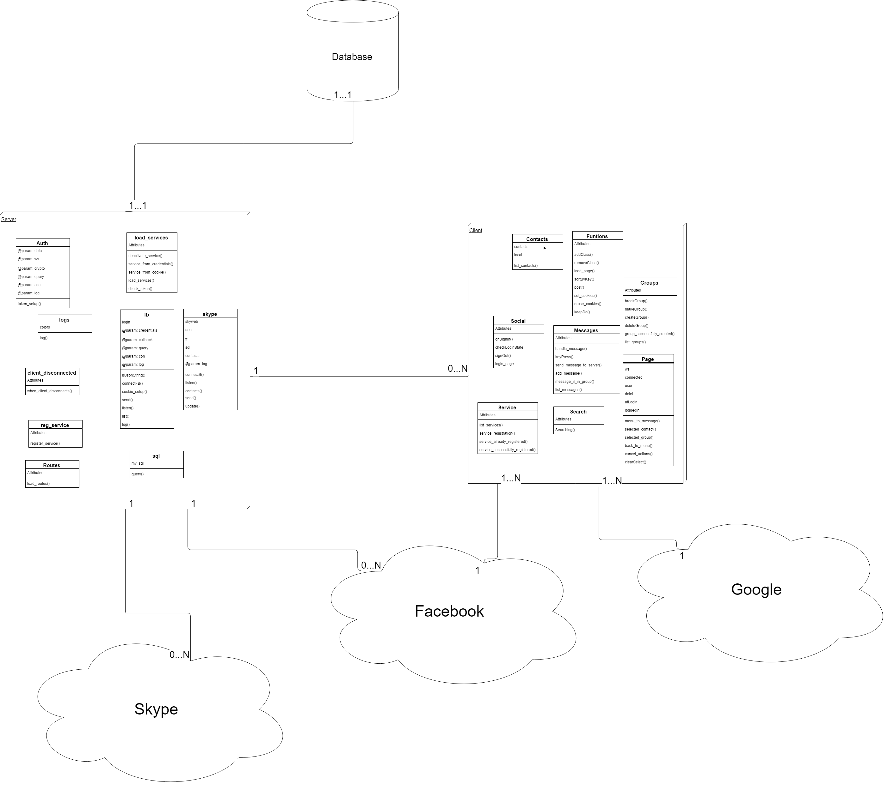
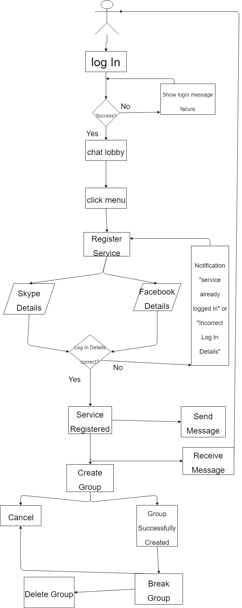
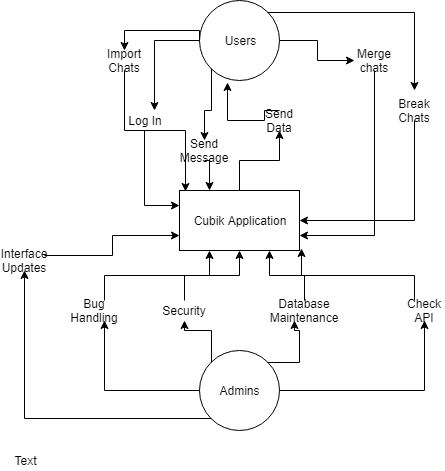
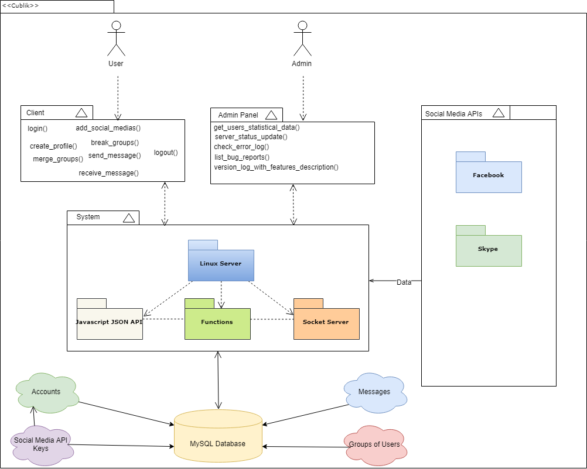

Table of Contents

===
&nbsp;

## [1.Introduction](#1-introduction)
### [1.1 Overview](#11-overview-1)	
### [1.2 Business Context](#12-business-context-1)	
### [1.3 Intended Audience and Reading Suggestions](#13-intended-audience-and-reading-suggestions-1)
### [&nbsp;&nbsp;&nbsp;&nbsp;&nbsp; 1.3.1 Glossary](#131-glossary)
&nbsp;

## [2.System Architecture](#2-system-architecture)
### [2.1 User](#21-user)	
### [2.2 Server](#22-server)						
### [2.3 Client](#23-client)
### [2.4 Materialize Design](#24-materialize-design)						

&nbsp;
## [3. High-Level Design](#3-high-level-design-1)
### [3.1 Introduction](#-31-introduction)
### [3.2 Design Goal](#32-design-goal)
### [3.3 Architecture](#33-)
### [3.4 Use Cases](#-34-)
###  [3.4.1 Login](#-341-login)
###  [3.4.2 Add Friend Chat](#-342-add-user)
###  [3.4.3 Combine](#-343-combine)
###  [3.4.4 Break](#-344-break)
###  [3.4.5 Delete](#-345-delete)
###  [3.4.6 Logout](#-347-logout)
### [3.5 User Flow Diagram](#-34-user-flow-diagram)
### [3.6 Context Diagram](#-34-context-diagram)
### [3.7 Class Diagram](#-35-class-diagram)

&nbsp;
## [4. Problems and Resolution](#-4-problems-and-resolution)
### [4.1 Social Media API](#41-)
### [4.2 Design Decisions](#42-)
### [4.3 Server Client Communication](#43-)
### [4.4 Code Readability](#44-)
### [4.5 Learning different coding languages](#45-)
## [5. Installation Guide](#-5-installation-guide)
### [5.1 Cross-Platform](#51-)
###	[ &nbsp; &nbsp; &nbsp; 5.1.1 Hardware](#511-)
### [&nbsp;&nbsp;&nbsp;&nbsp;&nbsp; 5.1.2 Software](#-512-)
### [&nbsp;&nbsp;&nbsp;&nbsp;&nbsp; 5.1.3 Version](#-513-)
### [5.2 Facebook/Google Login](#-52-)
###	[ &nbsp; &nbsp; &nbsp; 5.2.1 FaceBook](#521-)
### [&nbsp;&nbsp;&nbsp;&nbsp;&nbsp; 5.2.2 Google](#-522-)
&nbsp;
## [6. Maintenance](#-6-maintenance)
### [6.1 API](#-61-)
### [6.2 Server/Client ](#-62-)
### [6.3 Database](#-63-)
&nbsp;
## [7. Appendix](#-7-appendix-)
### [7.1 Appendix A: Resources](#-71-resources)
### [7.2 Appendix B: References](#-72-references)
       										 
&nbsp;

1 Introduction

===

### 
1.1 Overview

The product being developed is best described as a Messaging 
Application. It will allow people to link up their various social media 
chat client into one application. Members will be able accept
messages from various social medias in our application. They can then 
send one message, to another user that will send to all that users 
social media selected. The system was developed to serve the needs of 
people with limited time to check all their messaging services, 
this application helps satisfy that need. Various other functions are 
available, and these will be listed and explained more in depth later on in this manual. 
For now, we have decided to use two social medias as the foundation of 
this app, however for the future beyond the scope of the time limit of this project, we hope to add more Social medias.
 

Users will log into the our application using either facebook or google. when the user is logged in, they will face an empty chat lobby, where the user will be required to log into their perspective social media application. After logging into the application, the latest 20 chats of the social media selected will be imported, however using the search bar users can import any user in their list.
This will be true for two social media platforms. Facebook and Skype. Where the user has the control to merge and break group chats. An example would be where, i would add my friend Marin facebook and skype chat conversation into one, where the user will receive messages from both platform in our application. Sending messages, the application will respond with the same platform the message received was from.

### 
1.2 Business Context

There are four possible business contexts in relation to this product. 
These contexts are:

* *Selling the Application: The product could be sold in the electronic 
stores with a one-off payment.*

* *Buying the Application: Larger companies get in touch to buy the 
software.*
 
* *Advertising: The application can have a system for advertisement to 
develop, this can be generalized or targeted at specific users of the 
application.  There is also the  possibility that bigger companies 
like facebook and instagram would want to collaborate with our 
application.*

* *Features: Application can have special features within, that can only 
be accessed through a subscription or a fee.*

### 
1.3 Intended Audience and Reading Suggestions

The Application is targeting anyone who has more than one social media 
platform that we have chosen, therefore the target audience is very 
broad.  
This document is targeted for computer science majors, developers, 
computer science lecturers or anyone that has an interest in the application development process.

### 
1.3.1 Glossary

* **PHP**: Recursive acronym for PHP Hypertext Processor. An open 
source, server-side, HTML embedded scripting language used to create 
dynamic Web pages. 

* **API**: In computer programming, an application programming interface 
(API) is a set of subroutine definitions, protocols, and tools for 
building application software. In general terms, it is a set of clearly 
defined methods of communication between various software components.

* **Materialize Design Framework**: It is a complete open-source SDK. A 
modern responsive front-end framework based on Material Design  Concept 
designed by Google. 

* **Server**: Sharing data or resources among multiple clients, or 
performing computation for a client, also this will be our personal 
server.

* **HTML**: Acronym for: Hypertext Markup Language. This is the 
authoring language used to create documents on the World Wide Web.
 
* **SQL**:An example of Associative Memory in Databases and the 
implications in terms of programming languages is SQL. In SQL, data is 
stored as tuples (rows) in relations (tables).

* **MySQL**:MySQL is an open-source relational database management 
system

* **Session**: The period of time a user interfaces with an application. 
The user session begins when the user accesses the application and ends 
when the user quits the application. This also refers to the amount of 
time a user uses a website for. The session starts once the user logs in 
and finishes when the user logs out.

2	System Architecture

===

### 
2.1 User

User will have to log in with either Google or Facebook, where we will then store their token for the next time they log in, where we can identify them

### 
2.2 Server 

### 
2.3 Client

### 
2.4 Materialize Design

This applications design was made with the help of Google's Materialize Library, however the design of the application does not depend on it since we created our own css when we found difficulties dealing with the library, however some components do use the materialize library.
We picked this library since it was made with the intention of minimalizing the design and making it fluid. 

3 High-Level Design

===

### 
3.1 Introduction 

This part of the manual will explain the proposed design concepts of our messaging application "Cubik", diving into the goals of our application.The different user cases we will explain how the application functions with the many different functionality. At the end of this section, readers will understand the different dynamics this application has.

### 
3.2 Design Goal 

The main features of this application is to combine the different social media messaging platform into one, where users can select their existing accounts, sending and receiving messages from their various accounts into our application. Our goals can be identified as:
1.Add users chats from their favourite social medias into our platform.
2.Option to merge various social medias chats into one chat window.
3.Users have full control to combine or break their chat groups consisting of different friends social medias.

### 
3.3 Architecture 

The model of our application can be summarized with the diagram below, the server is in charge of authenticating users, and will only allow users logged in to use the application.
Once users are logged in, they will be given a certain token that identifies them, further into the application the users will be required to log into the various social medias, where certain tokens pertaining to that social media will allow the user to import their personal chats into our application.

### 
3.4 Use Cases 

## 3.4.1 Login

<table>
  
  <tr>
    <td>Description</td>
    <td>User Logs into the system using either facebook or google</td>
  
  </tr>
  <tr>
    <td>Goal</td>
    <td>User logs into the system successfully</td>

  </tr>
  <tr>
    <td>Assumptions</td>
    <td>User has a facebook or google account</td>
  
  </tr>
  <tr>
    <td>Success</td>
    <td>User successfully enters the chat lobby</td>
  
  </tr>
  <tr>
    <td>Fail</td>
    <td>Incorrect facebook email/password, incorrect google email/password
  </td>

  </tr>
  <tr>
    <td>Primary</td>
    <td>New or regular users</td>
   
  </tr>
  <tr>
    <td>Main Scenarios</td>
    <td>1. User logs into the system using his facebook account. 
    2.User logs into the system using his google account. 
    3.User creates a facebook account and logs into |the system using his new facebook account. 
    4.User creates a google account and logs into the system using his new google account.

</td>

  </tr>
</table>

## 3.4.2 Add Friend Chat

<table>
  
  <tr>
    <td>Description</td>
    <td>User Logs into the facebook/skype and imports their various chats</td>
  
  </tr>
  <tr>
    <td>Goal</td>
    <td>User successfully imports their chats into the system</td>

  </tr>
  <tr>
    <td>Assumptions</td>
    <td>User has a facebook or skype account with exisiting chat conversations</td>
  
  </tr>
  <tr>
    <td>Success</td>
    <td>User can use their prespective social media chats in Cubik application</td>
  
  </tr>
  <tr>
    <td>Fail</td>
    <td>Incorrect facebook/skype email/password, chats are not imported successfully.
  </td>

  </tr>
  <tr>
    <td>Primry</td>
    <td>Users with Facebook/skype accounts</td>
   
  </tr>
  <tr>
    <td>Main Scenarios</td>
    <td>1. User presses the add button and sees the two options of facebook and skype. 
    2. User inputs his facebook/google information and logs into their prespective chats. 
    3. User picks their existing chats to import to Cubik's System.

</td>

  </tr>
</table>

## 3.4.3 Combine

<table>
  
  <tr>
    <td>Description</td>
    <td>User clicks the combine button and combines selected chats into a group chat</td>
  
  </tr>
  <tr>
    <td>Goal</td>
    <td>Successfully combine various chats into a single group chat.</td>

  </tr>
  <tr>
    <td>Assumptions</td>
    <td>User has more than 1 chat exisiting in his account</td>
  
  </tr>
  <tr>
    <td>Success</td>
    <td>User can send and receive messages from the group chat from different sources./td>
  
  </tr>
  <tr>
    <td>Fail</td>
    <td>Chats didnt combine successfully, group chat doesn't receive and send messages properly.
  </td>

  </tr>
  <tr>
    <td>Primry</td>
    <td>Users with various existing chats</td>
   
  </tr>
  <tr>
    <td>Main Scenarios</td>
    <td>1. User clicks the combine button and combines his chats with a friend facebook and skype account. 
    2.The combined chat will have his friends skype and facebook account, showing the messages sent from the different social medias. 
    3.Automatically changes where the user sends the message, depending on the last messages source.  

</td>

  </tr>
</table>

## 3.4.4 Break

<table>
  
  <tr>
    <td>Description</td>
    <td>User breaks a previously combined chat into its various singular chats</td>
  
  </tr>
  <tr>
    <td>Goal</td>
    <td>User successfully gets back single user chats</td>

  </tr>
  <tr>
    <td>Assumptions</td>
    <td>User has a previously combined chats that was made from the Cubik interface</td>
  
  </tr>
  <tr>
    <td>Success</td>
    <td>User breaks the group chats into the his desired singular chats</td>
  
  </tr>
  <tr>
    <td>Fail</td>
    <td>User grouped chat stays combined
  </td>

  </tr>
  <tr>
    <td>Primry</td>
    <td>User with exisitng grouped chats in the Cubik interface.</td>
   
  </tr>
  <tr>
    <td>Main Scenarios</td>
    <td>1. User clicks the break button and dismantles his existing group chats, into their original singular chats.

</td>

  </tr>
</table>

## 3.4.5 Delete

<table>
  
  <tr>
    <td>Description</td>
    <td>User deletes his selected exisiting chats. </td>
  
  </tr>
  <tr>
    <td>Goal</td>
    <td>Successfully deletes the chat from the application</td>

  </tr>
  <tr>
    <td>Assumptions</td>
    <td>User has at least 1 chat conversation in the application</td>
  
  </tr>
  <tr>
    <td>Success</td>
    <td>User successfully deletes the selected chats from the application</td>
  
  </tr>
  <tr>
    <td>Fail</td>
    <td>User chat does not get deleted from the application
  </td>

  </tr>
  <tr>
    <td>Primry</td>
    <td>Users with existing chats</td>
   
  </tr>
  <tr>
    <td>Main Scenarios</td>
    <td>1. User clicks the delete button and highlights the chats he/she wants deleted. 

</td>

  </tr>
</table>

## 3.4.6 Logout

<table>
  
  <tr>
    <td>Description</td>
    <td>User Logs out of the application</td>
  
  </tr>
  <tr>
    <td>Goal</td>
    <td>User successfully logs out of the application</td>

  </tr>
  <tr>
    <td>Assumptions</td>
    <td>User has logged in the application previously</td>
  
  </tr>
  <tr>
    <td>Success</td>
    <td>User would need to relog into the application to access it</td>
  
  </tr>
  <tr>
    <td>Fail</td>
    <td>User can still access the application even after logging out
  </td>

  </tr>
  <tr>
    <td>Primry</td>
    <td>Users logged in</td>
   
  </tr>
  <tr>
    <td>Main Scenarios</td>
    <td>1. User clicks the logout button and is directed back to the login page. 
    2. User clicks the logout button but is still able to access the application without logging back in.

</td>

  </tr>
</table>

### 
3.5 User Flow Diagram

 

### 
3.6 Context Diagram 

### 
3.7 Class Diagram 

 4	Problems and Resolutions 

===

### 
4.1 Social Media API

Social medias all have different API's, where initially the project was designed to include the most popular social media platforms like Facebook,Twitter,Instagram and Whatsupp. However after investigating the different platforms, we found each application had a different difficult to use API's. Some API's didn't exist anymore, some were too deprecated to be used, others were not what our project covered and couldnt be used. Therefore we had to limit our scope to social media's that have working API's, that we could use in out project. After investigating the different API's we decided to use Facebook and Skype, since they were our best options. Even after using and coding the API's to work, problems still arised, especially when facebook changes something related to their features, the result is us changing the code to make it work again. 
There are not a lot of resources online to help develop and use API's, therefore we had to use our teamwork to continue building the necessary functionality.
If some problems arised with issues we didn't know how to deal with, we would ask our supervisor, Stephen Blotts, to help us make a decision.
Facebook API also had a hidden function which by default was no where to be found, we spent some time looking for alternatives. Eventually we solved the problem by discovering it from reading the API source code. 

### 
4.2 Design Decisions

Since the application was built using HTML/CSS and javascript, there were a lot of libraries available online to help design the application. 
After discussing the possibilities with each other, we found using the new Materialize Library would be perfect, since its designed to be streamlined with efficiency and fluidity being the concepts behind the library.
However after encountering the different problems arising from a new library, and the small amount of documentation, we had to improvise with our own CSS, and javascript. Our design is aimed to reduce the dependency of the library in our design, preferring to code our own design.
When it comes to difference of opinion in terms of design, we would usually discuss the pros and cons of each design, thinking about the user and the different hardware limitations and how it would affect the user experience. This method usually helped decide any differences we had, another solution we found was seeing how the well known social medias designed their chat application. Comparing the different designs and what we liked, we designed the chat application.
Our final phase of design, we asked different people to give use their experience using the application, and discuss how they felt about the design, changing a few things to depending on the feedback. 

## 
4.3 Server Client Communication

Setting up the server client communication, required some research on how it is set up. After setting up the communication, we needed to set up the database communication. Afterwards we needed to set up the authentication services for the different API's that we are using from the server side. we had to send to client service online status, so now they can use the system without breaking it,the problem is that if a user does before services are not registered, we ignore their token confirmation and they send it,
then our system sends them that we don't have a valid token, it's because we don't have the services which actually define the tokens
Therefore it can crash both ends if user tries to use the app immediately after the server is up, after services auth, it's safe to do so.
what else we can do to solve this problem is to give the client an user database ID so that token is not the only way they can authenticate.
However on one side of the coin this fixes the problem while leaving it more vulnerable on the other as tokens are relatively harder to guess than users IDs but I suppose if we ignore security for now, we can make this run with less errors.

## 
4.4 Code Readability

After implementing the two API's the client and server code consists of a lot of code thats very hard to read, figuring out what everything does takes time and a lot of thought process.
Therefore we decided to refactor the code by splitting up the different client and server functionality into separate files, although it temporarily broke the application, it made the code easier to read and navigate.

## 
4.5 Learning different Coding Languages

Since this project was mostly made with javascript, learning the new language and implementing advanced technologies was hard to learn. Using online resources helped resolve some problems, while some gave us enough guidance to get the code to work. 

 5 Installation Guide

===

### 
5.1 Cross-Platform

Our application will be cross-platform, any device with a internet connection and a web browser can access the application.

### 
5.1.1 Hardware

Application Hardware Specification: 
<li>Server</li>
<li>Desktop/Laptop</li>
<li>Mobile Device</li> 

### 
5.1.2 Software

The libraries that we used during the project

### 
5.1.3 Versions

Would need to update all the libraries to the latest version. 

### 
 5.2 Facebook/Google Login 

Users of the application would need at the very least a facebook or a google account to log into the application.

### 
5.2.1 FaceBook

Users logged in the application will need a facebook account to import their facebook chats to our application, making full use of our applications functionality.

### 
 5.2.2 Skype

Users logged in the application will need a skype account to import their skype chats to our application, making full use of our applications functionality.

 6	Maintenance

===

### 
 6.1  API

Make sure facebook/skype dont disable their API, need to constantly check that the API doesnt deprecate over time.

### 
 6.2 Server

Server is currently fragile and would need to be restarted incase an error occurs. In the future the hope is to improve the currents system error handling.
From the server perspective all server side code over time will degrade, which can cause a problem with security. 

### 
 6.3 Database

Database would need to get vacuumed over time.

 7	Appendix 

===
	

### 
 7.1 Resources

www.draw.io 
www.stackoverflow.com 
www.materializecss.com 
www.mysql.com  
www.w3cschools.com 
www.github.com 

### 
 7.2 References

www.google.com  
www.computing.dcu.ie/~davids/CA326/