<h1>Cubik User Manual</h1>

Table of Contents

===
&nbsp;

## [1.Login](#1-)
### [1.1 Facebook](#11-)	
### [1.2 Google](#12-)	

## [2.Chat Lobby](#2-)
### [2.1 Import Chats](#21)	
### [2.2 Sign In](#-341-)
### [2.2.1 Facebook/Skype](#-)		
### [2.3 Combine](#23-)
### [2.3.1 Groups](#24-)		
##  [2.4 Break](#3-)
### [2.5 Search bar](#32-)

&nbsp;
## [3.Messaging](#2-)
### [3.1 Enter Chat](#33-)
### [3.2 Use Cases](#-34-)
### [3.3 Receiving message](#-341-)
###  [3.4 Group Chat](#-342-r)

&nbsp;
## [4. Logout](#-4-)
&nbsp;

# Login

This is where you can log into the application, you have two options to log into Cubik.

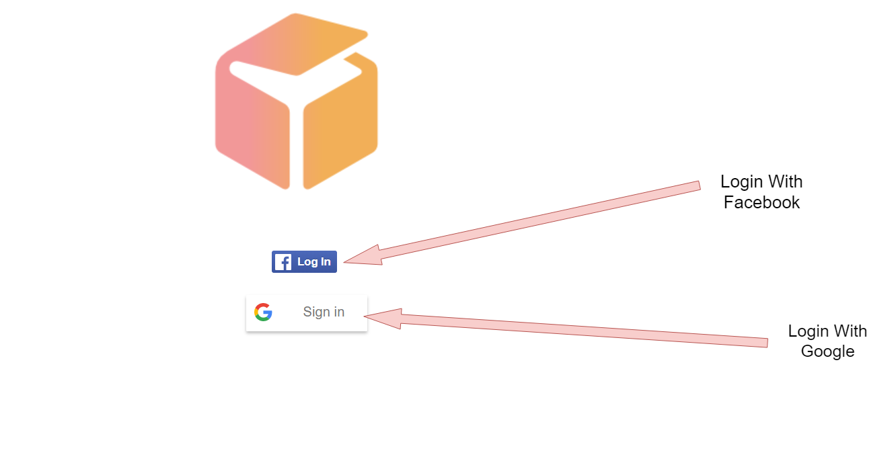

**Facebook**

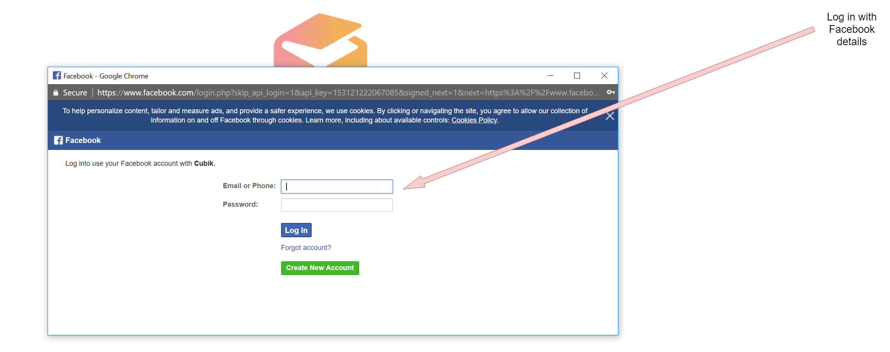 

**Google**

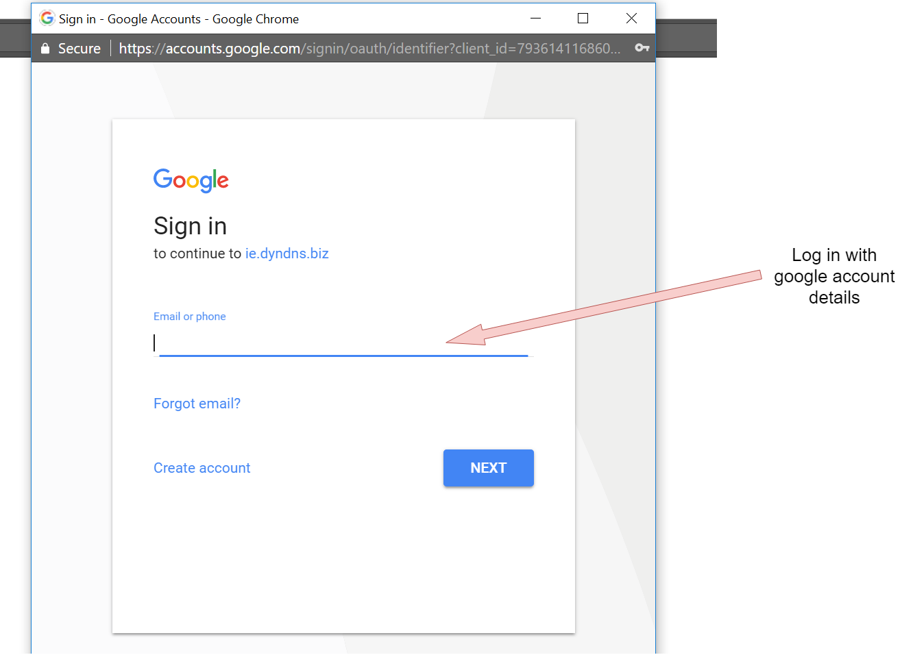 

# Chat Lobby

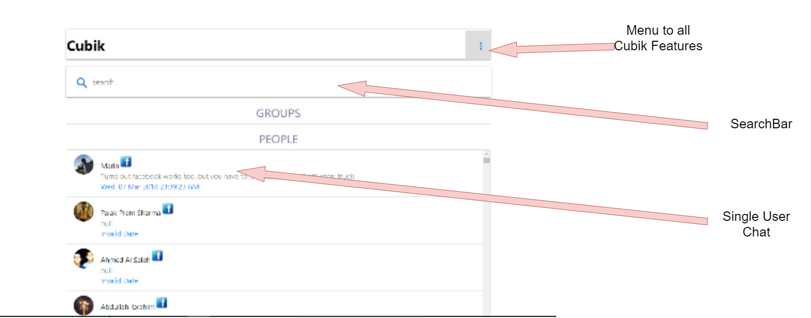 

This is the main chat lobby for the Cubik application, where groups created will be under the &quot;Group&quot; title and under &quot;People&quot; will be your imported chats. Clicking on the menu button on the top right of the screen will allow you to access all our features.

**Import Chat**

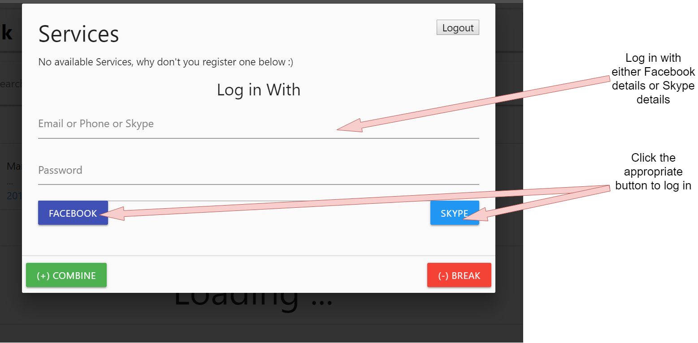 

This Service page is where you need to input your details allowing us to import your chats into our application.

**Sign in Facebook/Skype:**

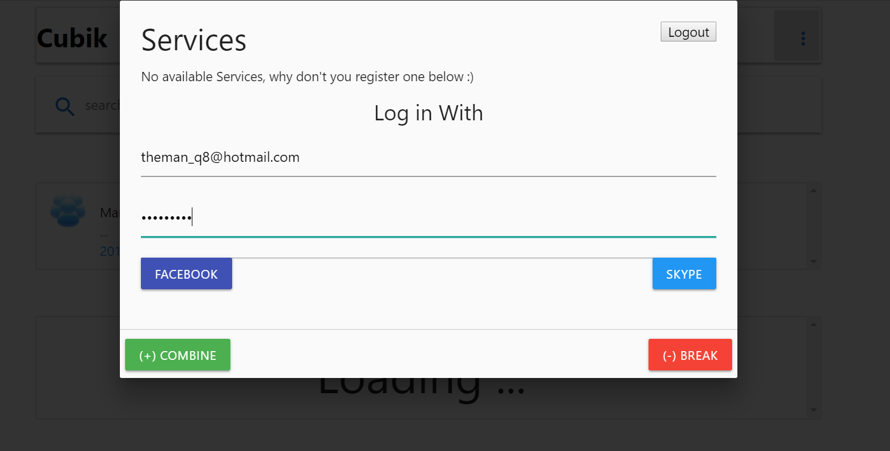 

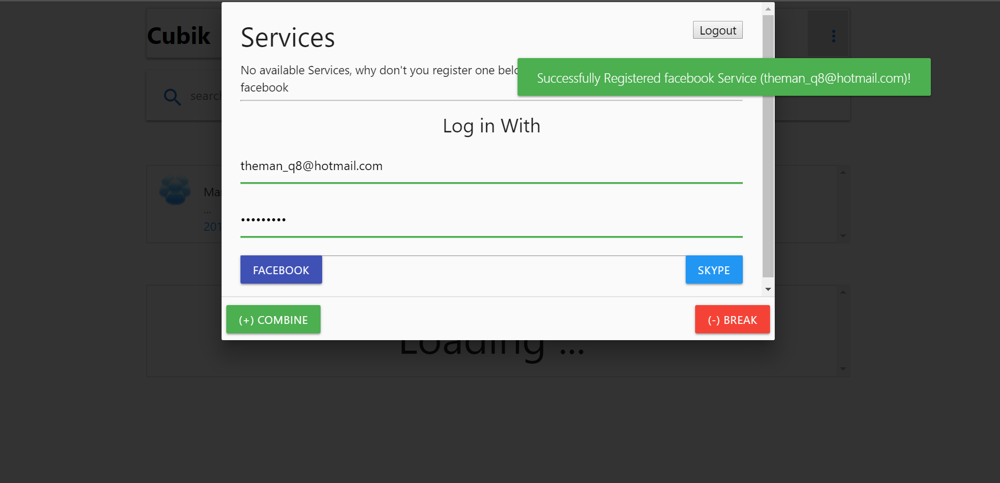 

After successfully inputting your Facebook/skype information, clicking on the respective button &quot;Facebook&quot; or &quot;Skype&quot; will register your information and your chats are now imported into our application.

 

Information shown on the Services, to informs you that there is no need to log into Facebook again, as its already registered the service, users can also sign into skype.

After successfully logging into both services, both chats are imported, you will not need to log into these services again and the application will remember you the next time you log in.

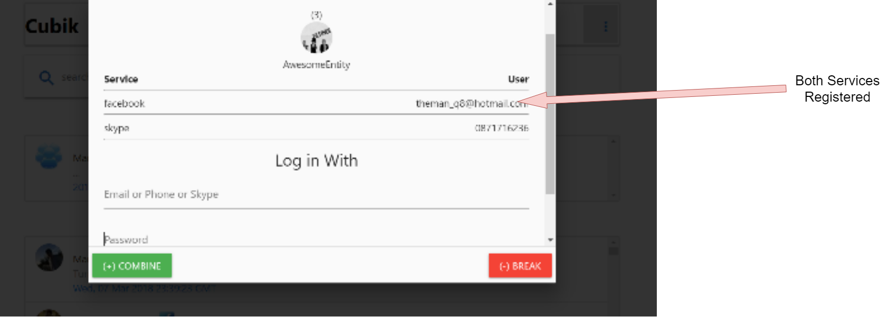 

**Combine:**

To create groups you will need to click the &quot;Combine&quot; button, before doing so ensure that you have successfully registered with at least one service(Facebook/Skype).

 

After clicking the &quot;Combine&quot; button, you will need to highlight the chats you want to create into a group, whether its Facebook or Skype does not matter. After selecting the chats, you want, click the create a group button on the top right. You can also press the &quot;Cancel&quot; button if you don&#39;t want to create a group anymore.

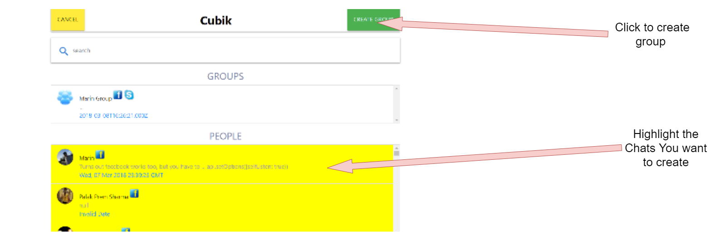 

After creating the group that you want, you can name the new group, if not then it will assign each group user&#39;s name as the group name.

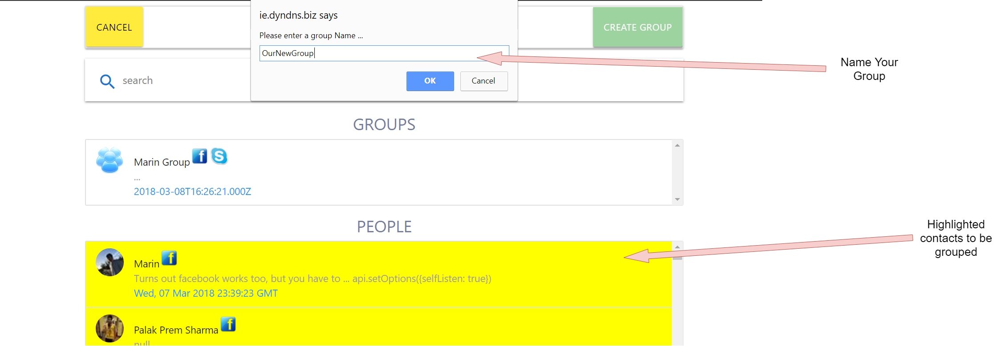 

The Newly created group will be under the &quot;Group&quot; title in the main chat lobby, where you can access it with simply clicking on the group.

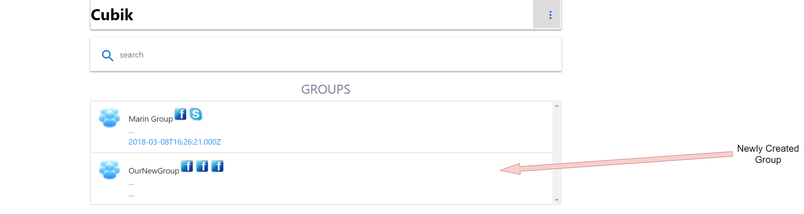 

**Break:**

To break(delete) the group you created you will need to click the &quot;Break&quot; button where you will then be redirected to the main lobby.

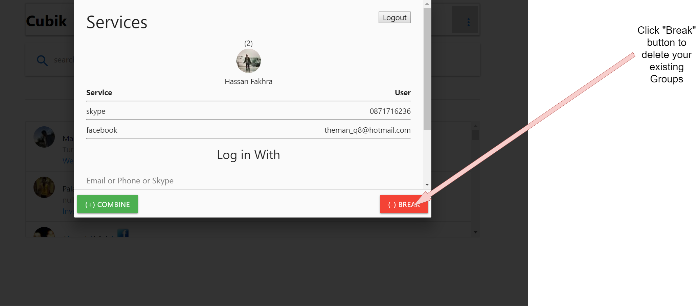 

You will highlight your existing groups where you will then click on the &quot;Delete Group&quot; button, after which the groups selected will be deleted.

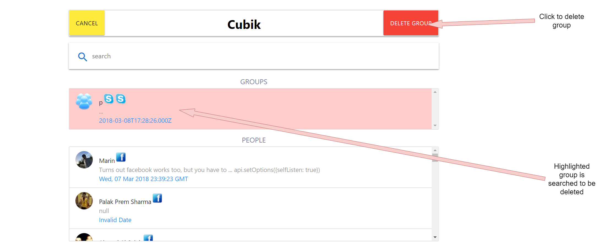 

**Search bar:**

You will also have access to a search bar that will search all your imported chats, where you can search for any contact you have and our search bar will also search for any words in the conversations you have had with your contacts.

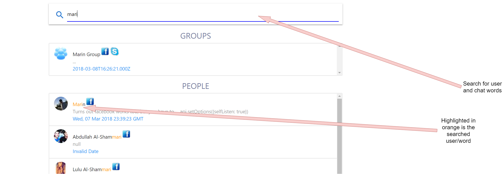 

# Messaging

  **Enter chat:**

 

To enter the chat simply clicking on the message box will make you enter the chat message window.

 

**Send message:**

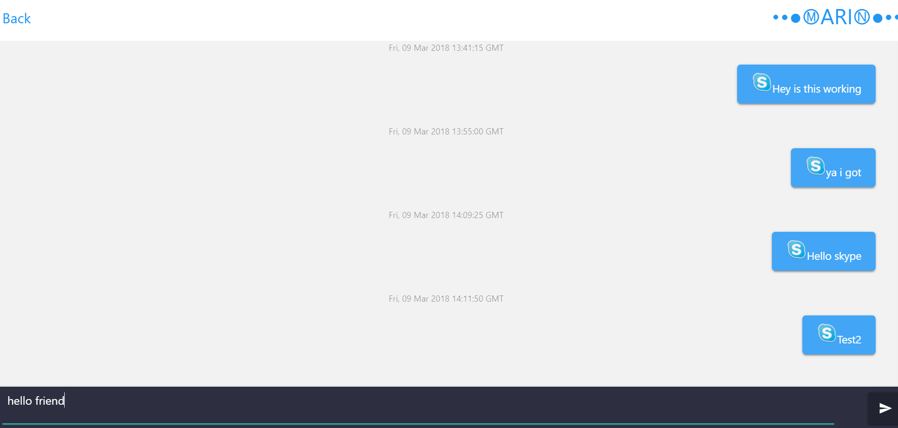

Here you can send a message to your friend

**Receiving message:**

Here your messages will be received from your contacts and will be shown.

**Group Chat:**

When creating the groups users will be identified by their avatar next to their message and the Social media account they sent the message from. They can also be identified if you hover over their name, where their name will show.

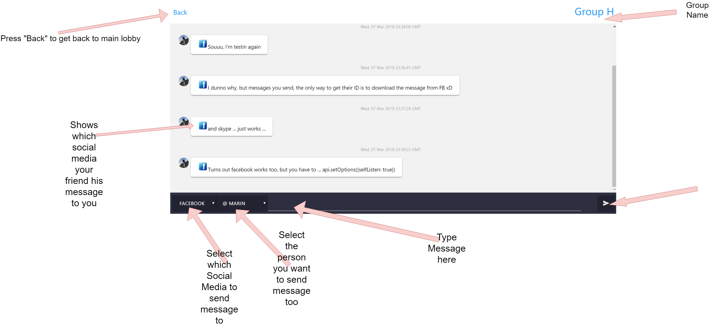 

Having different Social medias in the group chat, will allow the user to pick the social media they want to send the message too and to which user in the group. While you will receive any messages sent to you by any of the contacts in your group.

# Logout

User will need to click the logout button in the service area to log out of the application.

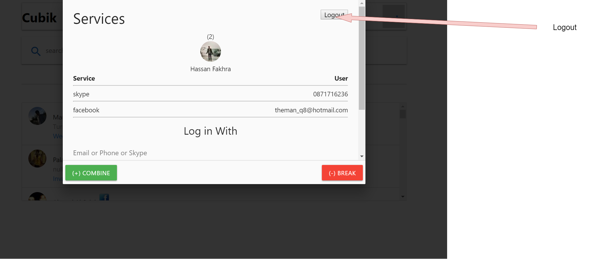 

Clicking this button, you will need to relog into the application, the existing contacts will still be available after logging out.